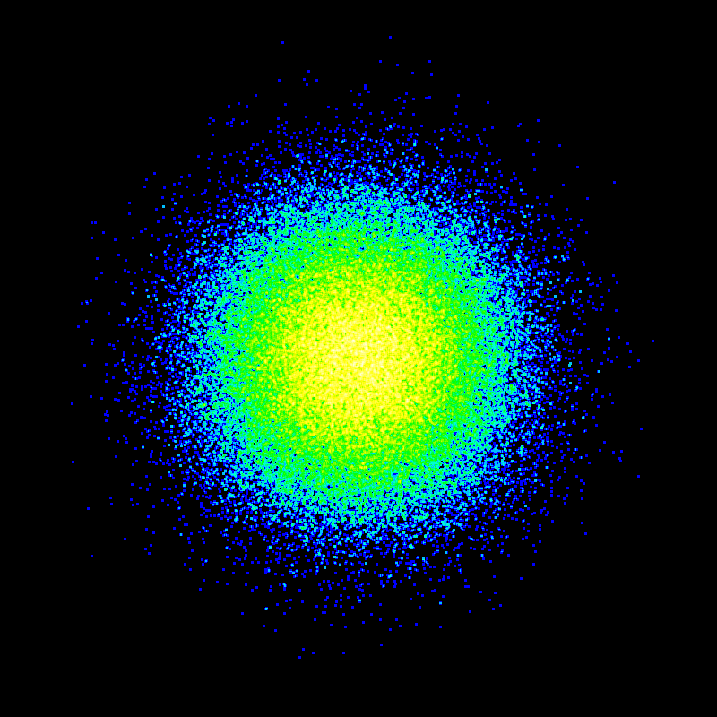

# sydney

*sydney* (note the lowercase *s*) is a high-performance graphics library for Go, specifically designed to render a huge number (hundreds of thousands or millions) of objects quickly and faithfully, without overplotting, oversaturating or otherwise obscuring fine detail that is present in the data. It is therefore well-suited as a plotting library for exploration and visualization of very large datasets.


## How to use it.

1. Import the relevant packages.

```golang
import (
	"fmt"
	"github.com/andrepxx/sydney/color"
	"github.com/andrepxx/sydney/coordinates"
	"github.com/andrepxx/sydney/scene"
	"math/rand"
	"image"
	imagecolor "image/color"
	"image/draw"
	"image/png"
	"os"
)
```


2. Generate some data.

```golang
data := make([]coordinates.Cartesian, 100000)

for i := range data {
	x := rand.NormFloat64()
	y := rand.NormFloat64()
	data[i] = coordinates.CreateCartesian(x, y)
}
```


3. Create a scene.

```golang
// scene.Create(resolutionX, resolutionY, minX, maxX, minY, maxY)
scn := scene.Create(800, 800, -5.0, 5.0, -5.0, 5.0)
```


4. Aggregate (plot) the data points into the scene.

```golang
scn.Aggregate(data)
```

You may call `scn.Aggregate(...)` multiple times to aggregate data in a streaming manner so that you don't have to generate / load all data points in advance and keep them in memory. You may call `scn.Clear()` to clear all data from the scene and re-use the scene object to render new data, as long as your viewport and image dimensions don't change.


5. Create a color mapping and render the data into an image.

A color mapping is responsible for mapping point densities to colors in the image. The default color mapping will map areas with low point densities to dark, cold colors (e. g. dark blue) and areas with high point densities to bright, hot colors (e. g. yellow or white). The mapping will be done in a logarithmic fashion and scale automatically to the highest and lowest densities found in the current scene to make best use of the available dynamic range.

```golang
mapping := color.DefaultMapping()
img, err := scn.Render(mapping)

/*
 * Check if an error occured during rendering.
 */
if err != nil {
	msg := err.Error()
	fmt.Printf("Something went wrong: %s\n", msg)
}
```

Since `color.Mapping` is an interface, you can easily implement your own custom color mapping.


6. Draw the data as an overlay on a background image.

The resulting image will be transparent, so you will probably want to overlay it on some background. We will choose a black background here and draw our rendered image data over it.

```golang
dim := image.Rect(0, 0, 800, 800)
target := image.NewNRGBA(dim)

/*
 * The background color.
 */
c := imagecolor.NRGBA{
	R: 0,
	G: 0,
	B: 0,
	A: 255,
}

uniform := image.NewUniform(c)
draw.Draw(target, dim, uniform, image.ZP, draw.Over)
draw.Draw(target, dim, img, image.ZP, draw.Over)
```


7. Serializing into a PNG file.

```golang
enc := png.Encoder{
	CompressionLevel: png.BestCompression,
}

fd, err := os.Create("output.png")

/*
 * Check if there was an error creating the file.
 */
if err != nil {
	msg := err.Error()
	fmt.Printf("Error creating output file: %s", msg)
} else {
	enc.Encode(fd, target)
	fd.Close()
}
```


8. Working with geographic data.

Since *sydney* was designed to work with large sets of geographic data, it has inbuilt support for projecting such data into a Cartesian coordinate system. If you have your data in geographic coordinates (longitude, latitude), you may ...

```golang
import "github.com/andrepxx/sydney/projection"
```

... and then project your data points from geographic coordinates into Cartesian points on a plane using a map projection (in this case, the Mercator projection) and render them.

```golang
data := make([]coordinates.Geographic, 100000)
// TODO: Fill the data slice.
proj := projection.Mercator()
numPoints := len(data)
projected := make([]coordinates.Cartesian, numPoints)

for i, elem := range(data) {
	projected[i] = proj.Forward(elem)
}

scn.Aggregate(projected)
```

Keep in mind that *sydney* expects longitude and latitude values in radians, not degrees, so you will have to pre-multiply your data with `math.Pi / 180.0` if your values are in degrees.


# Generated output




## Q and A

**Q: Can I see it in action? Is there a real-world application for this?**

**A:** There will be a *location-visualizer* application that makes use of this library to provide interactive views of large sets of location (e. g. GPS) data.

**Q: Why did you call this library *sydney*?**

**A:** Because there is already a graphics library called *cairo*.

